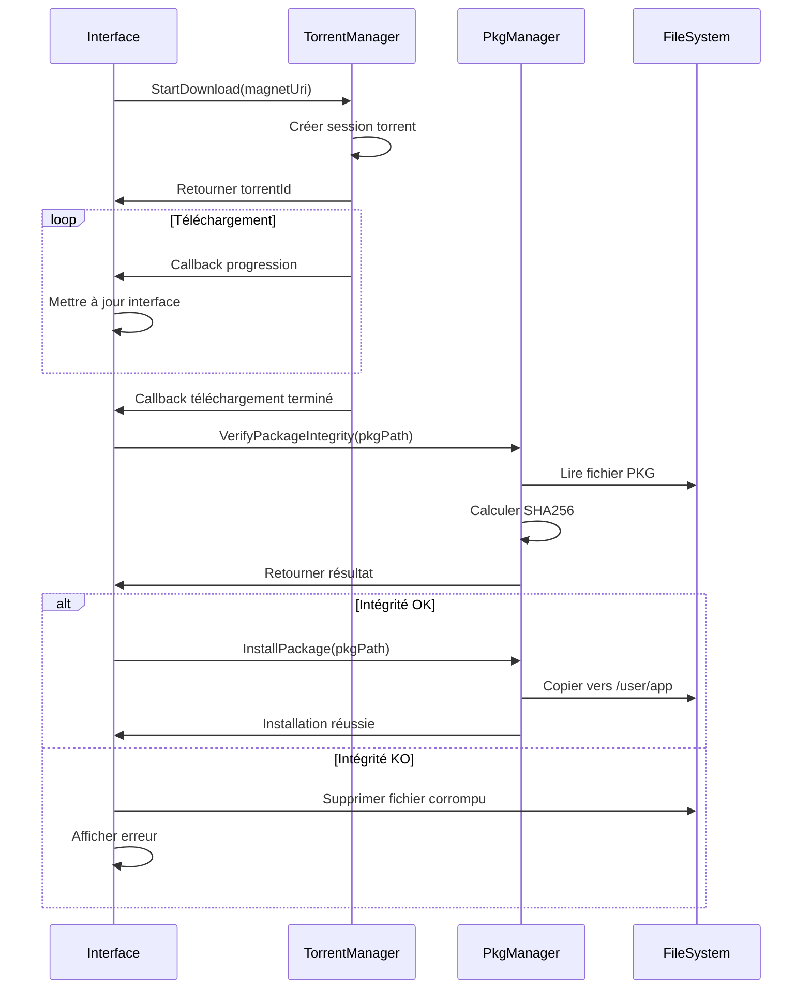
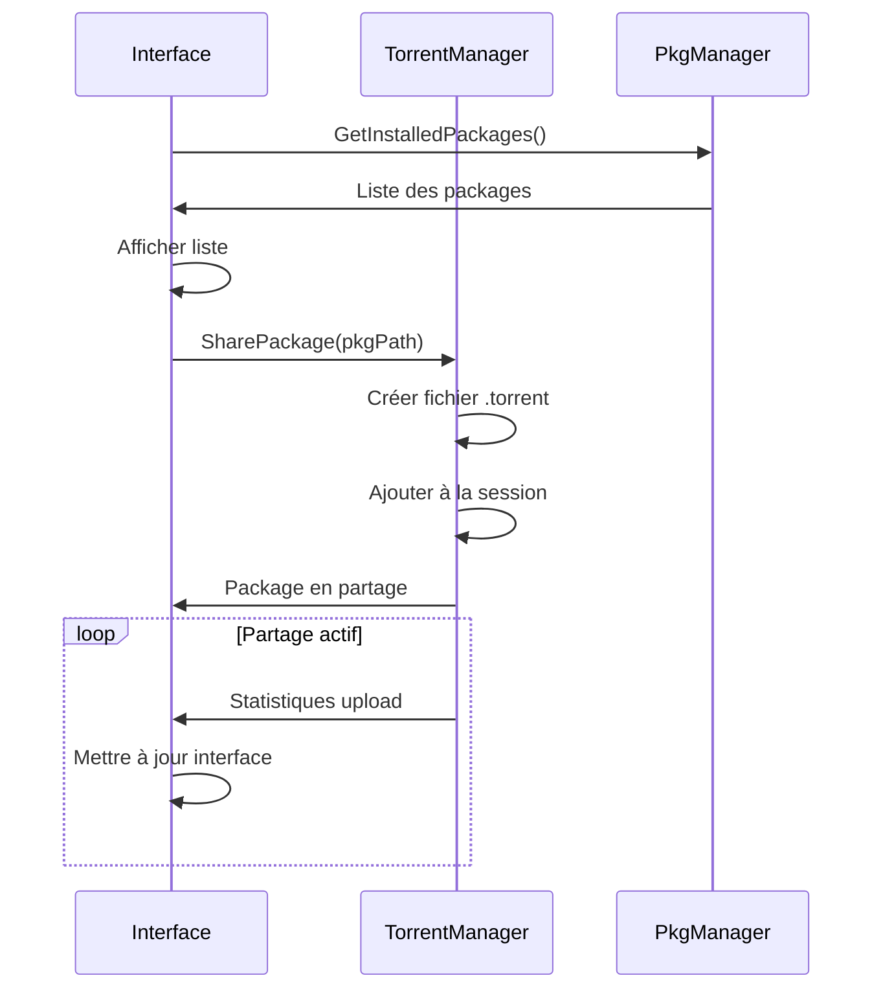

# Documentation Technique - PS4 Store P2P

## Vue d'ensemble

Ce document décrit l'architecture technique du store P2P décentralisé pour PS4 jailbreakée. Le projet vise à créer une application homebrew native permettant de télécharger et installer des packages PS4 via un réseau peer-to-peer.

## Architecture Générale

### Composants Principaux

```
┌─────────────────────────────────────────────────────────────┐
│                    PS4 Store P2P                            │
├─────────────────────────────────────────────────────────────┤
│  Interface Utilisateur (SDL2 + ImGui)                       │
│  ┌─────────────┬─────────────┬─────────────┬─────────────┐  │
│  │ Menu        │ Liste Jeux  │ Télécharge- │ Paramètres  │  │
│  │ Principal   │             │ ments       │             │  │
│  └─────────────┴─────────────┴─────────────┴─────────────┘  │
├─────────────────────────────────────────────────────────────┤
│  Gestionnaire P2P (libtorrent)                              │
│  ┌─────────────┬─────────────┬─────────────┬─────────────┐  │
│  │ DHT         │ Trackers    │ Peers       │ Torrents    │  │
│  │ Discovery   │ Management  │ Management  │ Management  │  │
│  └─────────────┴─────────────┴─────────────┴─────────────┘  │
├─────────────────────────────────────────────────────────────┤
│  Gestionnaire PKG                                           │
│  ┌─────────────┬─────────────┬─────────────┬─────────────┐  │
│  │ Analyse     │ Vérification│ Installation│ Désinstall. │  │
│  │ Packages    │ Intégrité   │             │             │  │
│  └─────────────┴─────────────┴─────────────┴─────────────┘  │
├─────────────────────────────────────────────────────────────┤
│  Utilitaires Système                                        │
│  ┌─────────────┬─────────────┬─────────────┬─────────────┐  │
│  │ Fichiers    │ Réseau      │ Logging     │ Config      │  │
│  │ I/O         │ Utils       │             │             │  │
│  └─────────────┴─────────────┴─────────────┴─────────────┘  │
└─────────────────────────────────────────────────────────────┘
```

### Technologies Utilisées

- **Langage**: C++ 17
- **SDK**: OpenOrbis PS4 Toolchain
- **Interface**: SDL2 + ImGui
- **P2P**: libtorrent-rasterbar
- **Build**: Make + CMake (alternatif)
- **Packaging**: orbis-pub-gen

## Modules Détaillés

### 1. Interface Utilisateur (UI)

#### Fichiers
- `include/ui/main_window.h`
- `src/ui/main_window.cpp`

#### Fonctionnalités
- **Menu Principal**: Navigation entre les différentes sections
- **Liste des Jeux**: Affichage des packages disponibles avec métadonnées
- **Gestionnaire de Téléchargements**: Suivi en temps réel des téléchargements P2P
- **Paramètres**: Configuration réseau, chemins, préférences
- **Détails des Jeux**: Informations détaillées, captures d'écran

#### États de l'Interface
```cpp
enum class UIState {
    MAIN_MENU,      // Menu principal
    GAME_LIST,      // Liste des jeux disponibles
    DOWNLOADS,      // Gestionnaire de téléchargements
    SETTINGS,       // Paramètres de l'application
    GAME_DETAILS    // Détails d'un jeu spécifique
};
```

#### Gestion des Événements
- **Contrôleur PS4**: Navigation avec les boutons et sticks
- **Clavier/Souris**: Support pour le développement sur PC
- **Callbacks**: Intégration avec les gestionnaires P2P et PKG

### 2. Gestionnaire P2P

#### Fichiers
- `include/p2p/torrent_manager.h`
- `src/p2p/torrent_manager.cpp`

#### Architecture libtorrent
```cpp
class TorrentManager {
public:
    // Session management
    static bool Initialize();
    static void Cleanup();
    
    // Torrent operations
    static std::string StartDownload(const std::string& magnetUri);
    static bool StopDownload(const std::string& torrentId);
    static bool RemoveDownload(const std::string& torrentId);
    
    // Sharing
    static bool SharePackage(const std::string& pkgPath);
    
    // Monitoring
    static DownloadInfo GetDownloadInfo(const std::string& torrentId);
    static std::vector<DownloadInfo> GetAllDownloads();
    
    // Configuration
    static void SetDownloadLimit(int kbps);
    static void SetUploadLimit(int kbps);
    static void SetListenPort(int port);
};
```

#### Fonctionnalités P2P
- **DHT (Distributed Hash Table)**: Découverte décentralisée des peers
- **Trackers**: Support des trackers BitTorrent publics
- **LSD (Local Service Discovery)**: Découverte des peers sur le réseau local
- **UPnP**: Configuration automatique du port forwarding
- **Encryption**: Chiffrement des communications P2P

#### Gestion des Sessions
```cpp
// Configuration de session libtorrent
lt::settings_pack settings;
settings.set_str(lt::settings_pack::user_agent, "PS4StoreP2P/1.0");
settings.set_bool(lt::settings_pack::enable_dht, true);
settings.set_bool(lt::settings_pack::enable_lsd, true);
settings.set_bool(lt::settings_pack::enable_upnp, true);
settings.set_int(lt::settings_pack::download_rate_limit, download_limit * 1024);
settings.set_int(lt::settings_pack::upload_rate_limit, upload_limit * 1024);
```

### 3. Gestionnaire PKG

#### Fichiers
- `include/pkg/pkg_manager.h`
- `src/pkg/pkg_manager.cpp`

#### Structure PKG PS4
```cpp
struct PkgHeader {
    uint32_t magic;           // 0x7F434E54
    uint32_t type;
    uint32_t pkg_size;
    uint32_t data_offset;
    uint64_t data_size;
    char content_id[36];
    // ... autres champs
};
```

#### Fonctionnalités
- **Analyse**: Extraction des métadonnées des fichiers PKG
- **Vérification**: Contrôle d'intégrité via SHA256
- **Installation**: Interface avec le système PS4 pour l'installation
- **Désinstallation**: Suppression propre des packages
- **Gestion**: Listage des packages installés

#### Processus d'Installation
```cpp
// 1. Vérification de l'intégrité
bool isValid = VerifyPackageIntegrity(pkgPath);

// 2. Analyse du package
PackageInfo info = AnalyzePackage(pkgPath);

// 3. Vérification de l'espace disque
if (!HasEnoughSpace(info.size)) {
    return false;
}

// 4. Installation via Debug Settings
bool success = InstallPackageDebug(pkgPath);
```

### 4. Utilitaires Système

#### Fichiers
- `include/utils/utils.h`
- `src/utils/utils.cpp`

#### Modules Utilitaires

##### Gestion des Fichiers
```cpp
class Utils {
public:
    // File operations
    static bool FileExists(const std::string& path);
    static bool CreateDirectory(const std::string& path);
    static uint64_t GetFileSize(const std::string& path);
    static bool CopyFile(const std::string& src, const std::string& dst);
    
    // String utilities
    static std::vector<std::string> SplitString(const std::string& str, char delimiter);
    static std::string FormatFileSize(uint64_t bytes);
    static std::string FormatSpeed(uint64_t bytesPerSecond);
};
```

##### Logging
```cpp
enum class LogLevel {
    DEBUG,
    INFO,
    WARNING,
    ERROR
};

static void Log(LogLevel level, const std::string& message);
static void LogToFile(const std::string& filename, const std::string& message);
```

## Flux de Données

### Téléchargement d'un Package



### Partage d'un Package



## Configuration Système

### Chemins PS4

```bash
# Répertoires système PS4
/user/app/           # Applications installées
/data/               # Données utilisateur
/system_data/        # Données système
/mnt/usb0/          # Clé USB (si connectée)
/mnt/usb1/          # Clé USB (si connectée)

# Répertoires du projet
/data/ps4_store/downloads/    # Téléchargements en cours
/data/ps4_store/cache/        # Cache métadonnées
/data/ps4_store/temp/         # Fichiers temporaires
/data/ps4_store/config/       # Configuration
```

### Modules Système PS4

```cpp
// Modules requis pour l'application
static const char* required_modules[] = {
    "libSceNet.sprx",           // Réseau
    "libSceNetCtl.sprx",        // Contrôle réseau
    "libSceSysmodule.sprx",     // Modules système
    "libSceUserService.sprx",   // Services utilisateur
    "libSceSystemService.sprx", // Services système
    "libScePad.sprx",           // Contrôleur
    "libSceAudioOut.sprx",      // Audio
    "libSceVideoOut.sprx"       // Vidéo
};
```

## Sécurité et Légalité

### Mesures de Sécurité

1. **Vérification d'Intégrité**: Tous les packages sont vérifiés via SHA256
2. **Sandbox**: L'application fonctionne dans le sandbox Orbis OS
3. **Permissions**: Accès limité aux répertoires autorisés
4. **Chiffrement**: Communications P2P chiffrées

### Considérations Légales

⚠️ **AVERTISSEMENT IMPORTANT**

Cette application est destinée uniquement à des fins éducatives et de recherche. Le partage de contenu protégé par le droit d'auteur est illégal dans de nombreuses juridictions.

**Responsabilités de l'utilisateur:**
- Respecter les lois locales sur le droit d'auteur
- Ne partager que du contenu dont vous possédez les droits
- Utiliser l'application à vos propres risques

## Compilation et Déploiement

### Prérequis

1. **OpenOrbis PS4 Toolchain**
2. **SDL2** (compilé pour PS4)
3. **ImGui** (sources)
4. **libtorrent** (compilé pour PS4)
5. **PS4 jailbreakée** avec GoldHEN

### Étapes de Compilation

```bash
# 1. Installation des dépendances
./install.sh --deps

# 2. Compilation du projet
make clean && make -j$(nproc)

# 3. Création du package PKG
make pkg

# 4. Installation sur PS4
# Via FTP ou clé USB
```

### Structure du Package Final

```
ps4_store_p2p.pkg
├── eboot.bin           # Exécutable principal
├── sce_sys/
│   ├── param.sfo       # Métadonnées application
│   ├── icon0.png       # Icône application
│   └── pic1.png        # Image de fond
└── data/
    ├── config.ini      # Configuration par défaut
    └── assets/         # Ressources graphiques
```

## Optimisations et Performance

### Optimisations Réseau

- **Limitation de bande passante**: Configurable pour éviter la saturation
- **Priorisation des téléchargements**: Files d'attente intelligentes
- **Cache DHT**: Persistance des informations de découverte
- **Compression**: Réduction de la taille des données échangées

### Optimisations Mémoire

- **Streaming**: Lecture des gros fichiers par chunks
- **Cache LRU**: Gestion intelligente du cache métadonnées
- **Pool d'objets**: Réutilisation des structures de données
- **Garbage collection**: Nettoyage automatique des ressources

### Optimisations Interface

- **Rendu différé**: Mise à jour uniquement des éléments modifiés
- **Pagination**: Affichage par pages pour les grandes listes
- **Préchargement**: Anticipation des besoins utilisateur
- **Animations fluides**: 60 FPS constant

## Dépannage

### Problèmes Courants

1. **Échec de compilation**
   - Vérifier l'installation d'OpenOrbis
   - Contrôler les chemins dans le Makefile
   - S'assurer que toutes les dépendances sont présentes

2. **Erreurs de connexion P2P**
   - Vérifier la configuration réseau PS4
   - Contrôler les paramètres de pare-feu
   - Tester avec différents trackers

3. **Échec d'installation PKG**
   - Vérifier que GoldHEN est actif
   - Contrôler l'espace disque disponible
   - S'assurer que Debug Settings est activé

### Logs de Débogage

```cpp
// Activation du mode debug
#ifdef DEBUG_BUILD
    Utils::SetLogLevel(LogLevel::DEBUG);
    Utils::EnableFileLogging("/data/ps4_store/debug.log");
#endif
```

## Roadmap et Évolutions

### Version 1.0 (Actuelle)
- ✅ Interface de base
- ✅ Téléchargement P2P
- ✅ Installation PKG
- ✅ Configuration

### Version 1.1 (Prochaine)
- 🔄 Amélioration de l'interface
- 🔄 Support des captures d'écran
- 🔄 Système de notation
- 🔄 Recherche avancée

### Version 2.0 (Future)
- 📋 Support des mises à jour automatiques
- 📋 Intégration avec les services en ligne
- 📋 Système de recommandations
- 📋 Support multi-langues

---

*Cette documentation est maintenue par l'équipe de développement PS4 Store P2P.*